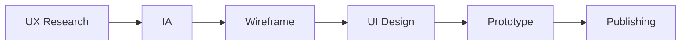
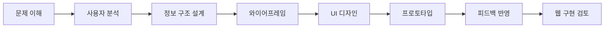
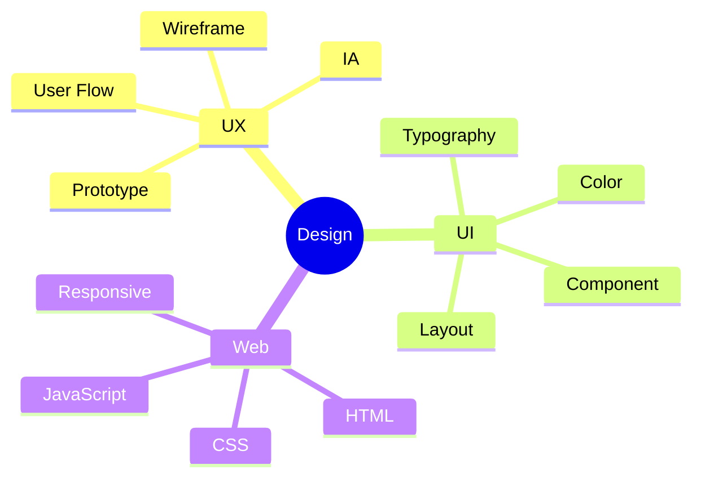

# UI/UX Designer · Web Designer

사용자의 흐름을 이해하고,  
**구현 가능한 웹 경험**을 설계하는 디자이너입니다.

`UI/UX Design` · `Web Design` · `Figma` · `HTML` · `CSS` · `JavaScript`

---

## About Me

| Area | Keywords |
|---|---|
| Design | UI/UX, Web Design, Visual Design |
| UX | User Flow, IA, Wireframe, Prototype |
| Frontend | HTML, CSS, JavaScript, Responsive Web |
| Interest | Design System, Accessibility, Publishing |

---

## What I Focus On

| Focus | Description |
|---|---|
| UI/UX Design | 사용자 흐름과 화면 구조 설계 |
| Web Design | 브랜드에 맞는 웹 인터페이스 디자인 |
| Frontend Publishing | 디자인을 실제 웹 화면으로 구현 |
| Design System | 일관성 있는 UI 컴포넌트 관리 |

---

## Skills

### Design

### Frontend

### Tools

---

## Portfolio Projects

| Project | Type | Main Work |
|---|---|---|
| UI/UX Design Project | UX/UI | User Flow, IA, Wireframe, Prototype |
| Web Design Project | Web Design | Main Page, Sub Page, Visual System |
| Publishing Project | Frontend | HTML, CSS, JavaScript, Responsive Web |

---

## Project Workflow

---

## My Design Process

---

## Design Thinking

---

## Currently Learning

---

## Contact

| Channel | Link |
|---|---|
| Email | your-email@example.com |
| Portfolio | 준비 중 |
| GitHub | https://github.com/your-github-id |

---

## GitHub Stats

